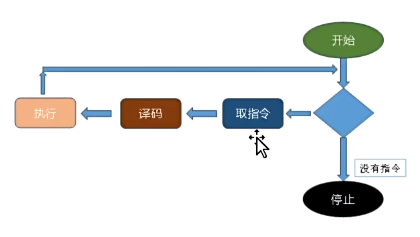
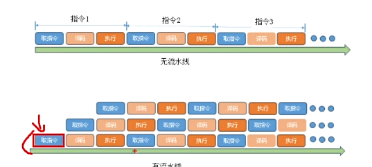

# 手搓计算机

## 冯诺依曼架构

### 四个基本组件
1. **存储器**
2. **逻辑单元 ALU**
3. **控制单元**
4. **输入输出**

### 核心概念
- **存储概念**：程序也必须在内存中
- **指令顺序执行**：控制单元提取指令、解释指令、执行指令

## 计算机组成部件

| 部件 | 功能 |
|------|------|
| **CPU** | 控制单元 + ALU，执行指令 |
| **内存** | 存储程序和数据 |
| **输入/输出** | 与外部设备交互 |

### CPU

**Central Processing Unit**，中央处理器

- **控制单元**：解释指令、控制数据流动
- **ALU**：执行算术运算(+-×÷)和逻辑运算(AND/OR/NOT)
- **寄存器**：高速临时存储区

### 内存

**Memory**，存储程序和数据

- **程序指令**：告诉CPU做什么
- **数据内容**：操作的对象
- **地址编码**：每个存储单元的唯一编号
- **RAM/ROM**：随机访问/只读存储器

### 输入输出

**I/O - Input/Output**

- **输入设备**：键盘、鼠标、传感器等 → 数据进入计算机
- **输出设备**：显示器、扬声器、执行器等 → 结果展示

### 计数器

**Program Counter (PC)**，程序计数器

- 记录下一条要执行的指令地址
- 每执行一条指令，PC自动+1
- 跳转指令可修改PC值

## 计算机架构图


> 点击查看：[architecture.drawio](architecture.drawio) - 可用 [draw.io](https://app.diagrams.net/) 打开编辑

## 机器周期



指令执行分为三个阶段：

1. **取指令** - 从内存读取下一条指令
2. **译码** - 解析指令含义
3. **执行** - 完成指令指定的操作

## 精简指令集

我们实现的是**精简指令集计算机(RISC)**：
- 电路简单
- 指令数量少但功能强大

> 典型应用：高通骁龙、苹果M系列芯片

## 流水线



流水线是指在指令执行过程中，**多条指令同时进行不同阶段**的执行。

### 优势
- **改善吞吐率**：单位时间可执行更多指令
- **提高效率**：同时执行多个阶段

### 工作原理
```
时刻1: [取指1] [---] [---]
时刻2: [译码1] [取指2] [---]
时刻3: [执行1] [译码2] [取指3]
时刻4: [---] [执行2] [译码3]
```
