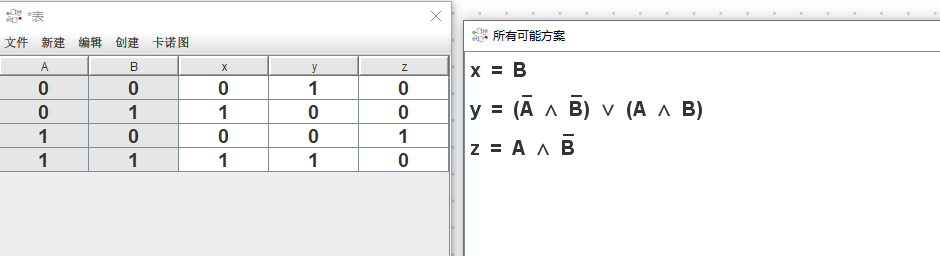
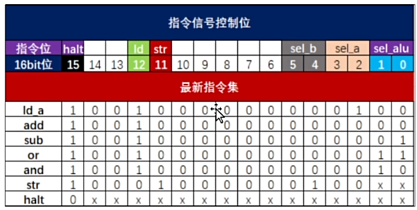

# 手搓计算机

## 冯诺依曼架构

### 四个基本组件
1. **存储器**
2. **逻辑单元 ALU**
3. **控制单元**
4. **输入输出**

### 核心概念
- **存储概念**：程序也必须在内存中
- **指令顺序执行**：控制单元提取指令、解释指令、执行指令

## 计算机组成部件

| 部件 | 功能 |
|------|------|
| **CPU** | 控制单元 + ALU，执行指令 |
| **内存** | 存储程序和数据 |
| **输入/输出** | 与外部设备交互 |

### CPU

**Central Processing Unit**，中央处理器

- **控制单元**：解释指令、控制数据流动
- **ALU**：执行算术运算(+-×÷)和逻辑运算(AND/OR/NOT)
- **寄存器**：高速临时存储区

### 内存

**Memory**，存储程序和数据

- **程序指令**：告诉CPU做什么
- **数据内容**：操作的对象
- **地址编码**：每个存储单元的唯一编号
- **RAM/ROM**：随机访问/只读存储器

### 输入输出

**I/O - Input/Output**

- **输入设备**：键盘、鼠标、传感器等 → 数据进入计算机
- **输出设备**：显示器、扬声器、执行器等 → 结果展示

### 计数器

**Program Counter (PC)**，程序计数器

- 记录下一条要执行的指令地址
- 每执行一条指令，PC自动+1
- 跳转指令可修改PC值

## 计算机架构图


> 点击查看：[architecture.drawio](architecture.drawio) - 可用 [draw.io](https://app.diagrams.net/) 打开编辑

## 机器周期


指令执行分为三个阶段：

1. **取指令** - 从内存读取下一条指令
2. **译码** - 解析指令含义
3. **执行** - 完成指令指定的操作

## 精简指令集

我们实现的是**精简指令集计算机(RISC)**：
- 电路简单
- 指令数量少但功能强大

> 典型应用：高通骁龙、苹果M系列芯片

## 流水线


流水线是指在指令执行过程中，**多条指令同时进行不同阶段**的执行。

### 优势
- **改善吞吐率**：单位时间可执行更多指令
- **提高效率**：同时执行多个阶段

### 工作原理
```
时刻1: [取指1] [---] [---]
时刻2: [译码1] [取指2] [---]
时刻3: [执行1] [译码2] [取指3]
时刻4: [---] [执行2] [译码3]
```

# CPU
Central Processing Unit

## ALU 算术逻辑单元

- 加法：A(16位) + B(16位)
- 减法：A(16位) - B(16位)
- 与门：A与B(16位) & B(16位)
- 或门：A或B(16位) | B(16位)
- 相等：A(16位) == B(16位)

## 复用器
- 复用器：根据控制信号选择不同的输入信号
- 例如：选择A或B，根据控制信号选择A或B的输出

哈哈, 用代码看就是这么个意思
```java
// 四个输入：S1、S2、S3、S4
// sel 是选择控制信号（0/1/2/3）
int mux4(int sel, int S1, int S2, int S3, int S4) {
    switch(sel) {
        case 0: return S1; // sel=00 → 输出S1
        case 1: return S2; // sel=01 → 输出S2
        case 2: return S3; // sel=10 → 输出S3
        case 3: return S4; // sel=11 → 输出S4
        default: return 0;
    }
}
```

### 比较器
真值表画法
A 比 B -> x 大于 B, y 等于 B, z 小于 B

| A | B | x | y | z |
|------|------|------|------|------|
| 0 | 0 | 0 | 1 | 0 |
| 0 | 1 | 0 | 0 | 1 |
| 1 | 0 | 1 | 0 | 0 |
| 1 | 1 | 0 | 1 | 0 |



# 指令集的定义


# 指令集的定义

| 指令区间 | bin_code | opcode | 英文符号 | 说明 |
|------|------|------|------|------|
| 0x0000 | 0000 0000 0000 0000 | 00000 | halt | 停止时钟 |
| 0x9144 | 0000 1000 0000 0000 | 00001 | ld_a | 将RAM的数据载入寄存器A |
| 0x9140 | 0001 0000 0000 0000 | 00010 | add | RAM的数据+寄存器A, 在存入寄存器A |
| 0x9141 | 0001 1000 0000 0000 | 00011 | sub | RAM的数据-寄存器A, 在存入寄存器A |
| 0x9143 | 0010 0000 0000 0000 | 00100 | and | RAM的数据与寄存器A, 在存入寄存器A |
| 0x9142 | 0010 1000 0000 0000 | 00101 | or | RAM的数据或寄存器A, 在存入寄存器A |
| 0x8950 | 0011 0000 0000 0000 | 00110 | str | 将寄存器A的数据存入RAM地址 |
| 0x9404 | 0011 1000 0000 0000 | 00111 | jmp | 无条件跳转到指定地址 |
| 0x9204 | 0100 0000 0000 0000 | 01000 | je | 比较相等时跳转到指定地址 |

